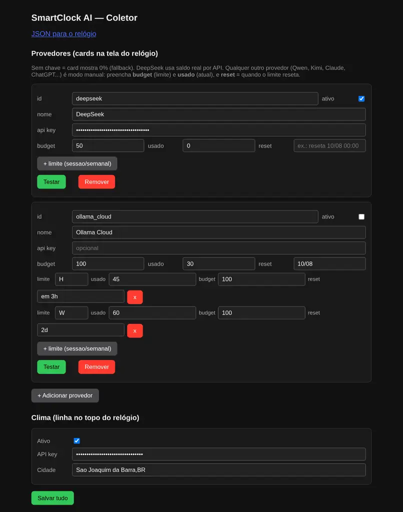
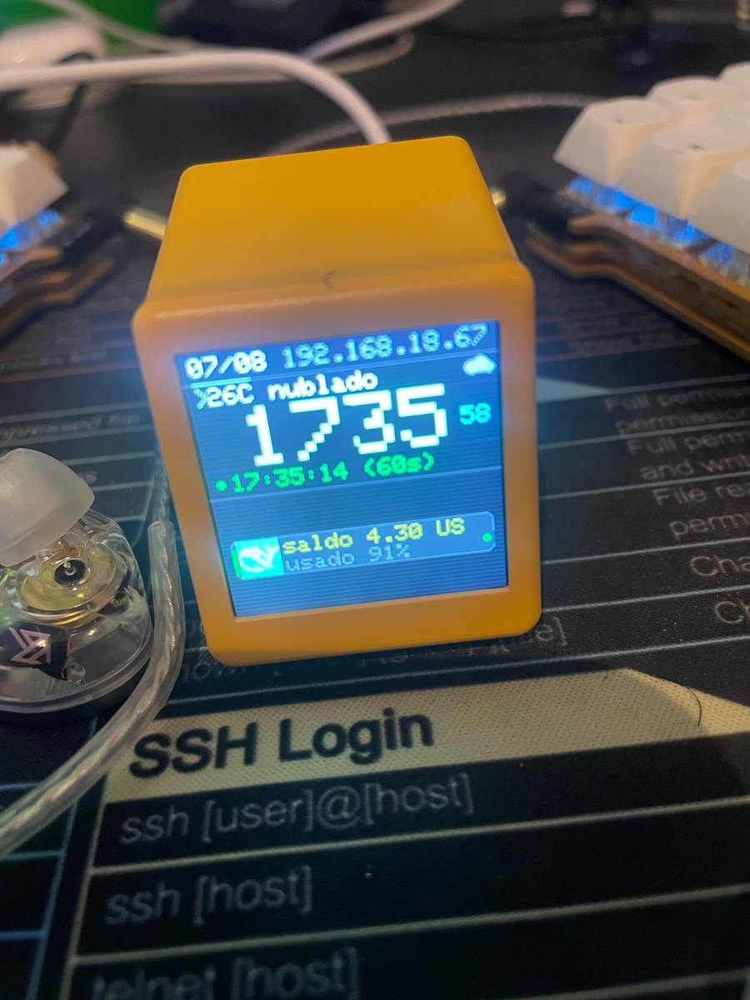
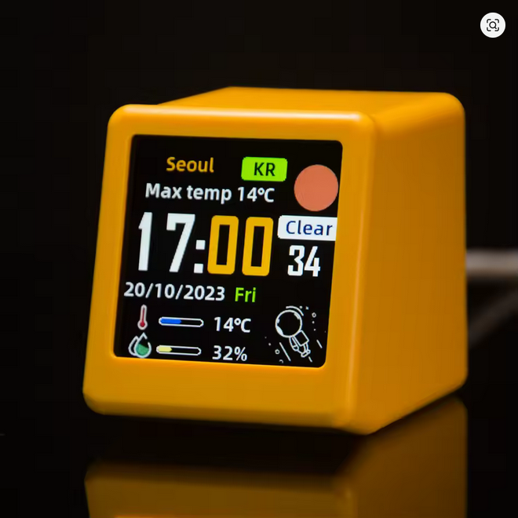

# ⏰ SmartClock AI — PHOSPHOR CONSOLE

Custom firmware + coletor para o **JUZIPi SD PRO** ("Smart Weather Clock", ESP8266 + ST7789 240×240),
com tema de terminal CRT e **easter egg animado de saldo** nas contas de IA.

```
┌─────────────┐  APIs de uso (quota)   ┌──────────────────┐
│ collector/  │ ─────────────────────▶ │ DeepSeek API     │
│ (Docker/PC) │                        └──────────────────┘
└──────┬──────┘
       │ GET /usage (JSON local, ex. http://192.168.18.7:8787/usage)
       ▼
┌─────────────┐  a cada N segundos (configurável) + animação 250ms
│ firmware/   │ ────────────────────────────────────────────────────┐
│ (ESP8266)   │  relógio 7-seg fósforo + clima + cards de provedor │
└─────────────┘
```

## 📸 Screenshots

| Interface web do coletor | Relógio configurado |
|---|---|
|  |  |

*Interface do coletor (ativar/desativar provedores, chaves, limites) e o relógio rodando o firmware.*

## 🛒 Onde comprar



Quer montar o seu? Compre o relógio **JUZIPi SD PRO** ("Smart Weather Clock") aqui:
[Comprar na AliExpress](https://s.click.aliexpress.com/e/_msaW5j1)

## ✨ O que a tela mostra

- **Relógio 7-segmento** verde-fósforo com sombra e dois-pontos piscando, scanlines de CRT
- **Clima atual** (OpenWeatherMap) com ícone procedural
- **Cards de provedores de IA** com logo da marca + linhas de limite:
  ```
  [🐋]  saldo 4.34 USD    ← % global (pior limite) no canto
        usado 91%         ← limite/saldo por linha, cor por uso
  ```
- **Limites múltiplos por provedor** (ex.: `H 45% em 3h` / `W 60% 2d`) — como o painel da Ollama
- **Easter egg de saldo**: LED por card que pulsa (verde = saldo), pisca (vermelho = esgotado) ou âmbar (sem chave)

## 📦 Estrutura

```
collector/    Serviço Python (Docker) + página web de gestão (http://<pc>:8787/)
firmware/     PlatformIO (C++/Arduino): src/main.cpp, src/logos.h (gerado), platformio.ini
scripts/      preview.py (mockup PNG/GIF da tela), logo2header.py, setup_keys.sh, build.sh
assets/       logos dos provedores + binário original (restore)
docs/         screenshots
design/       mockups e GIF do easter egg
```

## 🚀 Como usar

### 1. Coletor (no PC)

```bash
docker compose up -d --build     # http://0.0.0.0:8787/
```

Abre `http://<ip-do-pc>:8787/` — ative/desative provedores, cole chaves, configure
budget/limites/reset, teste a chave e o clima. Salvar grava `collector/config.yaml`
(backup `.bak`). Sem Docker: `python3 collector.py` (config em `collector/config.yaml`,
modelo comentado em `config.yaml.example`).

Chave do DeepSeek rápido: `./scripts/setup_keys.sh sk-XXXX`

### 2. Firmware

```bash
./scripts/build.sh    # compila e gera firmware/SDP_SmartClockAI_V1.0.0.bin
```

**Flash via OTA**: web UI do relógio (`http://<ip-do-relogio>/` → Firmware Update), arquivo
com prefixo `SDP`. O WiFi salvo é reutilizado. Config do relógio: URL do coletor, intervalo
(s), fuso horário (ex. `-10800` Brasil), OTA e link para o coletor.

### 3. Preview antes de flashar

```bash
.venv/bin/python scripts/preview.py --ip 192.168.18.67 --time 12:34:56        # PNG com dados reais
.venv/bin/python scripts/preview.py --demo --gif --out design/animation.gif   # GIF do easter egg
```

### 4. Restaurar firmware original

`assets/original/SDPro_V1.0.6_20260525_174828.bin` — mesmo web UI de OTA.

## 🔌 Provedores

| Provedor | Dados | Reset |
|---|---|---|
| **DeepSeek** | API real `GET /user/balance` (chave admin, conta pré-paga) | sem reset (saldo) |
| **Ollama Cloud** | Manual (sem API pública de quota — [ollama/ollama#16448](https://github.com/ollama/ollama/issues/16448)) | texto livre por limite |
| **Qwen, Kimi, Claude, ChatGPT...** | Manual (`used`/`budget` + limites) | texto livre por limite |

Cada provedor aceita **limites extras** (sessão/semanal/mensal): rótulo, usado, budget e reset.

## 🎨 Logos de novos provedores

1. Salve o PNG em `assets/logos/<id>.png` (transparente de preferência)
2. Ajuste `LOGO_MODE`/`BADGE_COLORS` em `scripts/logo2header.py`
3. `./scripts/logo2header.py` → `./scripts/build.sh` → flash

## 📱 Modelos compatíveis

| Modelo | Placa | Status |
|---|---|---|
| **JUZIPi SD PRO** | ESP8266 ESP-12F/12E + ST7789 240×240 | ✅ testado (este projeto) |
| **GeekMagic SmallTV** | ESP8266 (mesma placa) | ✅ mesmo pinout |
| **GeekMagic SmallTV Ultra** | ESP8266 | ✅ mesmo pinout |
| **GeekMagic SmallTV Pro** | ESP32 | ⚠️ requer outro env de build |
| **NMMiner NM-TV-154** | ESP32-C2 | ⚠️ requer outro env de build |

Verifique a placa (ESP8266 vs ESP32) **antes** de flashar — o firmware e o pinout abaixo são
para a família ESP8266. Na dúvida, abra o aparelho e confira o chip.

## 🖥️ Hardware (referência)

- ESP8266 ESP-12F/12E (4 MB) + ST7789 240×240 — MOSI=13, SCLK=14, CS=15, DC=0, RST=2, BL=5 (backlight ativo-baixo)
- Pinout da família SmallTV/Ultra (template [ESPHome](https://devices.esphome.io/devices/geekmagic-ultra/))

## 🔒 Segurança

- Web UIs **sem autenticação** (LAN) — rede doméstica confiável
- Chaves de API ficam **só no PC** (`collector/config.yaml`, fora do git), nunca no relógio
